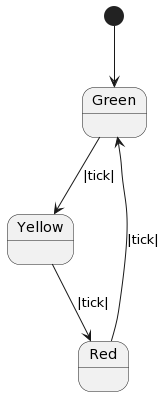

Persistence
==========

An important capability of many types of software applications is supporting **workflows**. 
A workflow is an asynchronously executed sequence of event driven 
steps. Most commonly
the asynchronous aspect of a workflow means that the system needs to be persisted to a durable medium
between each step in the process. 

Frame for Python supports a pattern for persistence using the `jsonpickle library <https://jsonpickle.github.io/>`_ 
combined with Frame operations. 

To perform a deep copy of a system, create an operation (ours is called **marshal**) 
that uses **jsonpickle.encode(self)** to get a JSON object containing the state 
of the system:

.. code-block::
    :caption: Operation to Deep Copy the System State

    operations:

        marshal(): JSON {
            return jsonpickle.encode(self)
        }

Persisting the system is as simple as calling the **marshal** operation and then saving the data 
to some durable medium (disk, database, etc.). For simplicity we will simply keep
the data in memory for these demos.

.. code-block::
    :caption: Use of marshal functionality

    var ds = DurableSystem()

    // get a deep copy of the system data
    var system_data = ds.marshal()

    // remove reference to the system
    ds = nil

To reconstitute a system, we will use 
a *static* operation **unmarshal [data]**  and return the output 
of **jsonpickle.decode(data)**: 

.. code-block::
    :caption: System Reconstitution 

    operations:

        #[static]
        unmarshal(data): DurableSystem {
            return jsonpickle.decode(data)
        } 

To access this static operation we call **unmarshal** through the system type specifier
itself rather than an instance of the system (as there isn't one): 

.. code-block::
    :caption: Persistence Mechanisms

    // Restore system using static operation
    ds = DurableSystem.unmarshal(data)

The **ds** variable now references the **DurableSystem** instance in the state it 
was persisted.

Persistence Demo 
----------------

Let's create a persistable system that tracks how many times its been 
saved and restored. Our **PersistDemo** system 
has a single state **$Start** which has a state variable **revived_count** which will be used to 
track how many times the state (and by proxy, the system) has been revived. 

.. code-block::
    :caption: State with Counter for Revival Count

    machine:

        $Start {
            var revived_count = 0

            $>() {
                print("Started")
                return
            }

            revived() {
                revived_count = revived_count + 1
                print("Revived = " + str(revived_count) + " times")
                return
            }
        }

The first time the **$Start** is entered is during instantiation, which happens only once when 
the system is initially created. It does *not happen* again with each reinstantiation. To keep 
count of the number of revivals, we have a state variable **revived_count** which will 
be incremented and printed when the **revived** event is received. To do so, we will call the
**revived** interface method before returning the system to the caller: 

.. code-block::
    :caption: Persistence Demo

    operations:

        #[static]
        unmarshal(data): PersistDemo {
            var demo = jsonpickle.decode(data)
            demo.revived()
            return demo
        } 

We will start by creating the system and then immediately persisting it:

.. code-block::
    :caption: Persistence Demo

    var demo = PersistDemo()

    // get deep copy
    var data = demo.marshal()

    // remove reference to system
    demo = nil

Upon creating the demo we will see the following output from the **$Start** state enter 
event handler: 

.. code-block::
    :caption: Start State Enter Message

    Started

Next we will loop 3 times, reviving and persisting the system with each loop: 

.. code-block::
    :caption: Main Loop

    for var i = 0; i < 3; i = i + 1 {

        // Restore system using static operation
        demo = PersistDemo.unmarshal(data)

        // get deep copy
        data = demo.marshal()

        // remove reference to the system
        demo = nil
    }

Each loop will increment **revival_count** and print it: 

.. code-block::
    :caption: Perisitance Demo Output 

    Revived = 1 times
    Revived = 2 times
    Revived = 3 times

Here is the full program: 

.. code-block::
    :caption: Persistence Demo

    `import sys`
    `import time`
    `import jsonpickle`

    fn main() {

        var demo = PersistDemo()

        // get deep copy
        var data = demo.marshal()

        // remove reference to system
        demo = nil

        for var i = 0; i < 3; i = i + 1 {

            // Restore system using static operation
            demo = PersistDemo.unmarshal(data)

            // get deep copy
            data = demo.marshal()

            // remove reference to the system
            demo = nil
        }

    }

    system PersistDemo {

        operations:

            #[static]
            unmarshal(data): PersistDemo {
                var demo = jsonpickle.decode(data)
                demo.revived()
                return demo
            }

            marshal(): JSON {
                return jsonpickle.encode(self)
            }

        interface:

            revived()

        machine:

            $Start {
                var revived_count = 0

                $>() {
                    print("Started")
                    return
                }

                revived() {
                    revived_count = revived_count + 1
                    print("Revived = " + str(revived_count) + " times")
                    return
                }
            }
    }

Persisted Traffic Light 
-----------------------

As an incremental step towards a workflow example, the Traffic Light system in the next 
demo implements a cycle of persisted state transitions.

The main loop will first instantiate and then persist the TrafficLight system. After sleeping, 
the program will enter a loop that reloads the system, sends a tick to it,  
persists the system again and then sleeps. 

.. code-block::
    :caption: Traffic Light Demo

    `import sys`
    `import time`
    `import jsonpickle`

    fn main() {

        var tl = TrafficLight()
        var data = tl.marshal()
        tl = nil
        time.sleep(.5)

        for var x = 0; x < 9; x = x + 1 {
            tl = TrafficLight.unmarshal(data)
            tl.tick()
            time.sleep(.5)
            data = tl.marshal()
            tl = nil
        }
    }

    system TrafficLight {

        operations:

            #[static]
            unmarshal(data): TrafficLight {
                return jsonpickle.decode(data)
            }

            marshal(): JSON {
                return jsonpickle.encode(self)
            }
        
        interface:

            tick()

        machine:

            $Green {
                $>() {
                    print("Green")
                    return
                }

                tick() {
                    -> $Yellow
                    return
                }
            }

            $Yellow {
                $>() {
                    print("Yellow")
                    return
                }

                tick() {
                    -> $Red
                    return
                }
            }

            $Red {
                $>() {
                    print("Red")
                    return
                }

                tick() {
                    -> $Green
                    return
                }
            }
    }

.. code-block::
    :caption: Traffic Light Demo Output

    Green
    Yellow
    Red
    Green
    Yellow
    Red
    Green
    Yellow
    Red
    Green

Workflows
----------

Our final demo is a true workflow which builds upon the core functionality of the Traffic 
Light demo and ties together many of the capabilities 
shown in the previous demos. The flow progresses from an initial **$Ready** state through a couple 
of "work" steps and terminates in the **$Done** end state. Any additional events 
to progress the flow after reaching **$Done** results in an increasingly urgent
response to the caller that the workflow is complete.

.. code-block::
    :caption: Workflow Demo

    `import sys`
    `import time`
    `import jsonpickle`

    fn main() {

        // instantiate system
        var flow = Workflow()

        // delay
        time.sleep(1)
        
        for var i = 0; i < 4; i = i + 1 {
            flow.next()

            // Persist workflow
            var data = flow.marshal()

            // dereference system
            flow = nil

            // delay
            time.sleep(1)

            // Revive workflow
            flow = Workflow.unmarshal(data)
        }

        flow.next()
        flow = nil
    }

    system Workflow {

        operations:

            #[static]
            unmarshal(data): Workflow {
                return jsonpickle.decode(data)
            }

            marshal(): JSON {
                return jsonpickle.encode(self)
            }
        
        interface:

            next()

        machine:

            $Ready {
                $>() {
                    print("Ready")
                }

                next() {
                    -> $Step1
                }
            }

            $Step1 {
                $>() {
                    print("Doing Step1")
                }

                next() {
                    -> $Step2
                }
            }

            $Step2 {
                $>() {
                    print("Doing Step2")
                }

                next() {
                    -> $Done
                }
            }

            $Done {
                var exclaimation_count = 1

                $>() {
                    print("Done.")
                }

                next() {
                    print("I told you I was done", end="")
                    for var i = 0; i < exclaimation_count; i = i + 1 {
                        print("!", end="")
                    }
                    exclaimation_count = exclaimation_count + 1
                    print("")
                }
            }
    }

.. code-block::
    :caption: Workflow Demo Output

    Ready
    Doing Step1
    Doing Step2
    Done.
    I told you I was done!
    I told you I was done!!