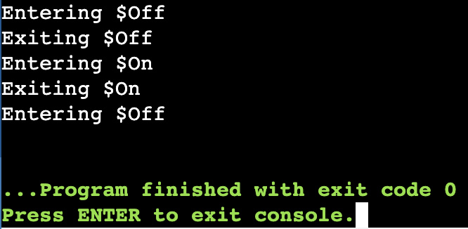

A Quick Introduction to Frame Programming
===========================

Frame is a Domain Specific Language (DSL) for the design of digital systems. As such, it has very different syntax 
than other languages. In this article we will explore a simple model of a Lamp (the system) to see how Frame 
enables architects and programmers to organize software in natural alignment with the contours of the 
logical problem they are trying to solve. 

System Design with Frame
------------------------

Frame notation promotes three concepts as first class aspects of the language that don't exist in mainstream programming languages:

#. Systems 
#. States
#. Events

Systems
^^^^^^^

A system is indicated by an identifier preceeded by the '#' token and terminated by the '##' token:

.. code-block::
    :caption: Empty System

    #Lamp
        // Frame single line comment uses C language comment syntax
    ##

Above we see a Frame *specification* for a lamp "system". Currently this system does absolutely nothing. 

States
^^^^^^^

To improve our lamp, lets start by adding two states - **$Off** and **$On** - to our spec.

.. code-block::
    :caption: Machine Block and States

    #Lamp

        -machine-

        $Off

        $On

    ##

As with "#" for systems, Frame uses a special prefix token "$" to indicate that an identifier is a state. Frame systems
have  "blocks" that provide the structure for a system spec. States must be declared inside the system "-machine-" block. 

Currently these states don't do anything. Let's fix that.

Events
^^^^^^^

Events drive activity in Frame systems. To do so, we must add **event handlers** to our states to provide 
behavior for our lamp.

.. code-block::
    :caption: Event Handlers

    #Lamp

        -machine-

        $Off                    // $Off state
            |turnOn|            // event selector for 'turnOn' event message
                -> $On          // transition to $On state
                ^               // return from event handler

        $On                     // $On state
            |turnOff|           // event selector for 'turnOff' event message
                -> $Off         // transition to $Off state
                ^               // return from event handler

    ##

Let's explore each aspect of the event handlers. 

Event Handlers
^^^^^^^

Event handlers always begin with an **event selector** for an event message **|msg|** and end with an event handler terminator 
which, in this case, is a return token **^** which terminates the event handler. 

.. code-block::
    :caption: Event Selector

    |msg|  ^ // Event handler with no behavior
    

Event handlers contain the behavior of the system. The only behavior for our lamp so far is
to **transiton** between the **$Off** and **$On** states. Frame transitions use the transition operator '->' which references the
target state the machine will transition to.

.. code-block::
    :caption: Transitions

    -> $TargetState ^

With this level of capability, we have defined a simple Lamp system **state machine** with two states. 
Frame's notation makes it easy to 
understand the purpose and behavior of each state and how they respond to events. 

The Interface Block
^^^^^^^

Despite having a simple lamp state machine defined, there is currently no way to send an event to the machine
to make it do anything. To enable that capability we add an **-interface-** block containing two public interface methods 
which will generate the events we need to drive the machine activity:

.. code-block::
    :caption: Interface Block and Methods

    #Lamp

        -interface-

        turnOn      // Interface method that sends 'turnOn' event to the machine
        turnOff     // Interface method that sends 'turnOff' event to the machine

        -machine-

        $Off                   
            |turnOn|            
                -> $On  ^              

        $On                      
            |turnOff|           
                -> $Off  ^           

    ##

Identifiers in the `-interface-` block generate public methods for the system. So now an external client of the 
system can interact with it and make it do something. 

When `turnOn` and `turnOff` interface methods are called, Frame generates an event with the same name as the method and sends 
it into the machine which, in turn, will respond if it is in a state that handles that event type. If the 
current state does not handle the event it will simply be ignored. 

Enter and Exit Events
^^^^^^^

Lets add more capability to our lamp. For this simple demo we 
will just log that we have entered and exited the **$Off** and **$On** states. 

To do so we will utilize special events that Frame generates when a system transitions from one state to another. 

.. code-block::
    :caption: State Enter and Exit Events

    $Off   
        ...

        |<|  // Exit Event
            print("Exiting $Off") ^

        |turnOn|            
            -> $On  ^              

    $On  
        |>|  // Enter Event 
            print("Entering $On") ^ 

        ...

When a transition occurs Frame generates two special events - **Exit** and **Enter**. In the example above, if the system is in the `$Off` state 
and receives the `|turnOn|` event it will transition to `$On`. In doing so, the Frame runtime will first send an exit event ``<``
to `$Off` which will print "Exiting $Off". Next the system will update the state to  ``$On`` and subsequently send 
an enter event ``>`` to `$On` which will print "Entering $On".

Enter and exit events provide "hooks" that can be used to initialize and clean up states. This capability is a powerful tool for 
better coding practices and often makes reasoning about complex system behavior much easier. 

.. code-block::
    :caption: Lamp System

    #Lamp

        -interface-

        turnOn      
        turnOff

        -machine-

        $Off   
            |>| print("Entering $Off") ^ 
            |<| print("Exiting $Off") ^

            |turnOn|            
                -> $On  ^              

        $On  
            |>| print("Entering $On") ^ 
            |<| print("Exiting $On") ^
            
            |turnOff|           
                -> $Off  ^           

    ##

So now we have created a specification for out lamp system, but how do we actually run it? Let's explore how to create
a complete Python program to run our Lamp. 

Frame Programs
^^^^^^^^^^^^^^

Frame, like other languages, provides a special entry point for execution called the `main` function. In main we will instantiate 
our Lamp and turn it on and off. 

.. code-block::
    :caption: Lamp Program

    fn main {
        var lamp:# = #Lamp()
        lamp.turnOn()
        lamp.turnOff()
    }

Frame's syntax for `main` does not have an argument list (e.g. `main(a,b)`) if no environment variables are passed 
to the program. 

We also see that a system controller is instantiated using `#Lamp()` which indicates this is a Frame system spec being
created.

.. code-block::
    :caption: Lamp Controller Instantiation

    var lamp:# = #Lamp()

Frame  uses the `var` keyword to declare variables and `:#` is a special Frame type for a system controller instance. 

After instantiation the lamp controller is told to turn itself on and then back off:

.. code-block::
    :caption: Lamp Interface Calls

    lamp.turnOn()
    lamp.turnOff()

We are now have all the basics needed to run our first Frame program. 

Executing Frame Programs
^^^^^^^^^^^^^^

Frame makes designing, developing and testing state machines easy and intuitive.  Here is our final Lamp program:

.. code-block::
    :caption: Complete Lamp Program

    fn main {
        var lamp:# = #Lamp()
        lamp.turnOn()
        lamp.turnOff()
    }

    #Lamp

        -interface-

        turnOn      
        turnOff

        -machine-

        $Off   
            |>| print("Entering $Off") ^ 
            |<| print("Exiting $Off") ^

            |turnOn|            
                -> $On  ^              

        $On  
            |>| print("Entering $On") ^ 
            |<| print("Exiting $On") ^
            
            |turnOff|           
                -> $Off  ^               

    ##

Here you can try running the program_.

.. _program: https://onlinegdb.com/fcVOr4FgpB

You should see this output:

As a bonus, Frame also can generate system documentation as well: 

``UML``

.. image:: https://www.plantuml.com/plantuml/png/SoWkIImgAStDuG8oIb8L_DFI5AgvQc6yF30dMYjMGLVN3YJ91SGWDaZAIa5DsT38nBgaj2ZFFm_2vWAAGvMYo0FvK0KEgNafGFi0
