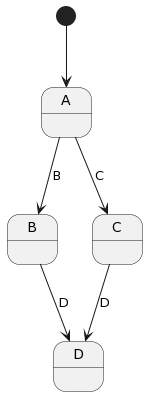
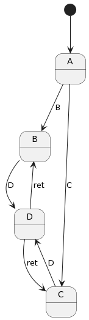
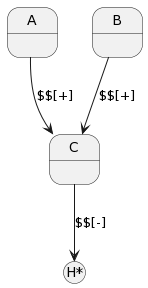
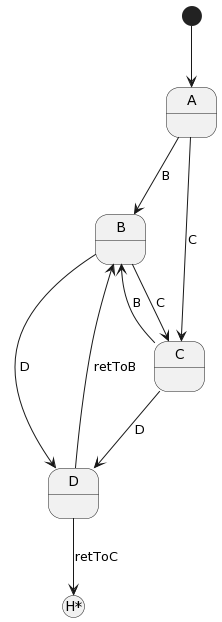
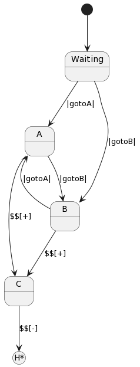
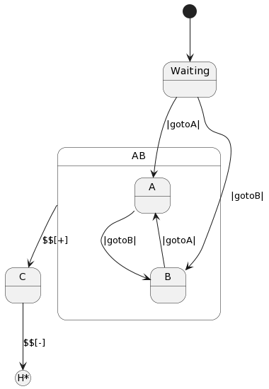

=============
State History
=============

It is sometimes useful to be able to be able to generically transition to a previous state.
An example of this situation is state that
manages a dialog box that can be shown in many different situations. Once it has
been dismissed, however, the system needs to go back to whatever the prior context which 
might have been any number of possible previous states.

To address this kind of scenario Frame supports a “history” mechanism.

History 101
-----------

The following spec illustrates the limitation of state machines with regards
to history. Below we see states `$B` and `$C` both transition into state `$D`.
However, without using some kind of record keeping, there is no natural way for 
the state machine to know whether to return to **$B** or **$C**.

.. code-block::

    #History101

      -machine-

        $A
            |gotoB| -> "B" $B ^
            |gotoC| -> "C" $C ^

        $B
            |gotoD| -> "D" $D ^

        $C
            |gotoD| -> "D" $D ^

        $D

    ##

The machine itself so far has no mechanism to remember where it came from.
To return to the previous state it would need to save that information and 
use it to decide between the two return transition paths. 

.. code-block::

    #History102

      -machine-

        $A
            |gotoB| -> "B" $B ^
            |gotoC| -> "C" $C ^

        $B
            |gotoD| -> "D" $D("B") ^

        $C
            |gotoD| -> "D" $D("C") ^

        $D [previous_state]
            |return| 
                previous_state == "B" ? -> $B ^ :>
                previous_state == "D" ? -> $C ^ :| ^

    ##

Compartments
------------

State Stack Operators
------------

For our problem with remembering the last state, a stack will do nicely thus
giving us the power of a Pushdown Automata. To support this, Frame has two
special operators:

.. list-table:: State Stack Operators
    :widths: 25 25
    :header-rows: 1

    * - Operator
      - Name
    * - $$[+]
      - State Stack Push
    * - $$[-]
      - State Stack Pop

Let’s see how these are used:

.. code-block::

    #History103

      -machine-

        $A
            |gotoC| $$[+] -> "$$[+]" $C ^

        $B
            |gotoC| $$[+] -> "$$[+]" $C ^

        $C
            |return| -> "$$[-]" $$[-] ^

    ##

What we see above is that the state stack push token precedes a transition to a
new state:

.. code-block::

    $$[+] -> $NewState

while the state stack pop operator produces the state to be transitioned into:

.. code-block::

    -> $$[-]

.. code-block::
    :caption: History 104 Demo 

    fn main {
        var sys:# = #History104()
        sys.gotoB()
        sys.gotoD()
        sys.ret()
        sys.gotoC()
        sys.gotoD()
        sys.ret()
    }

    #History104

        -interface-
    
        gotoB
        gotoC
        gotoD
        ret 
 

        -machine-

        $A
            |>| print("In $A") ^
            |gotoB| -> "B" $B ^
            |gotoC| -> "C" $C ^

        $B
            |>| print("In $B") ^
            |gotoC| -> "C" $C ^
            |gotoD| $$[+] -> "D" $D ^

        $C
            |>| print("In $C") ^
            |gotoB| -> "B" $B ^
            |gotoD| $$[+] -> "D" $D ^

        $D 
            |>| print("In $D") ^
            |ret| 
                print("returning to ...") 
                -> $$[-] ^

    ##

Run the `program <https://onlinegdb.com/uqUx2C2tlI>`_. 

The program generates the following output:

.. code-block::
    :caption: History 104 Demo Output

    In $A
    In $B
    In $D
    returning to ...
    In $B
    In $C
    In $D
    returning to ...
    In $C

History 202
-----------

In our next example we will combine HSMs for refactoring behavior out of two
states and show how it can work together with the state history mechansism.

The History202 spec below starts in a `$Waiting` state and then transitions
to `$A` or `$B` depending on how the client drives it.

From there both states have an identical handler to transition to `$C`.

.. code-block::

    #History202

     -interface-

     gotoA
     gotoB
     gotoC
     goBack

     -machine-

       $Waiting
           |>| print("In $Waiting") ^
           |gotoA| print("|gotoA|") -> $A ^
           |gotoB| print("|gotoB|") -> $B ^

       $A
           |>| print("In $A") ^
           |gotoB| print("|gotoB|") -> $B ^
           |gotoC| print("|gotoC|") $$[+] -> "$$[+]" $C ^

       $B
           |>| print("In $B") ^
           |gotoA| print("|gotoA|") -> $A ^
           |gotoC| print("|gotoC|") $$[+] -> "$$[+]" $C ^

       $C
           |>| print("In $C") ^
           |goBack| print("|goBack|") -> "$$[-]" $$[-] ^

       -actions-

       print [msg:string]

   ##

.. raw:: html

    <iframe width="100%" height="475" src="https://dotnetfiddle.net/Widget/aofLnO" frameborder="0"></iframe>

Refactoring Common Behavior
---------------------------
Now lets refactor the common event handler into a new base state.

.. code-block::
    :caption: History 3 Demo 

    #History203

       -interface-

       gotoA
       gotoB
       gotoC
       goBack

       -machine-

       $Waiting
           |>| print("In $Waiting") ^
           |gotoA| print("|gotoA|") -> $A ^
           |gotoB| print("|gotoB|") -> $B ^

       $A => $AB
           |>| print("In $A") ^
           |gotoB| print("|gotoB|") -> $B ^

       $B => $AB
           |>| print("In $B") ^
           |gotoA| print("|gotoA|") -> $A ^

       $AB
           |gotoC| print("|gotoC| in $AB") $$[+] -> "$$[+]" $C ^

       $C
           |>| print("In $C") ^
           |goBack| print("|goBack|") -> "$$[-]" $$[-] ^

       -actions-

       print [msg:string]

    ##

We can see that the duplicated |gotoC| event handler is now moved into $AB and
both $A and $B inherit behavior from it.

.. raw:: html

    <iframe width="100%" height="475" src="https://dotnetfiddle.net/Widget/U1axyV" frameborder="0"></iframe>

.. note::
    History203 demonstrates the recommended best practice of using a Frame
    specification to define a base class (in this case _History203_) and then
    derive a subclass to provide the implemented actions for behavior.

Conclusion
----------

The History mechanism is one of the most valuable contributions of Statecharts
to the evolution of the state machine.

This article introduced the base concept and use case for state history and
showed its implementation in Frame. In addition, it showed how it works in
conjunction with Hierarchical State Machines. The combination of these two
capabilities makes Statecharts and Frame a powerful and efficient way to both
model and create complex software systems.
