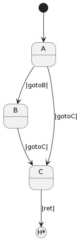

=============
State History
=============

It is sometimes useful to be able to be able to generically transition to a previous state.
An example of this situation is state that
manages a dialog box that can be shown in many different situations. When the dialog
is dismissed, however, the system needs to return to its previous context, which  
may have been any number of possible states that launched the dialog.

To address this kind of scenario Frame supports a “history” mechanism.

History 101
-----------

The following spec illustrates the limitation of state machines with regards
to history. Below we see states **$B** and **$C** both transition into state **$D**.

.. code-block::

    #History101

      -machine-

        $A
            |gotoB| -> "B" $B ^
            |gotoC| -> "C" $C ^

        $B
            |gotoD| -> "D" $D ^

        $C
            |gotoD| -> "D" $D ^

        $D

    ##

.. image:: images/history1.png

To return to the previous state there needs to be a way to save that information and 
use it to decide between the two possible return paths. There are a few 
ways we could do this but for this example we will simply choose to pass a state argument containing 
the name of the state that we transitioned from. This value will be used 
in **$D** to determine which state to return to.

.. code-block::
    :caption: History 102 - Return to State Using a State Name

    #History102

      -machine-

        $A
            |gotoB| -> "B" $B ^
            |gotoC| -> "C" $C ^

        $B
            |gotoD| -> "D" $D("B") ^

        $C
            |gotoD| -> "D" $D("C") ^

        $D [previous_state]
            |ret| 
                previous_state == "B" ? -> "ret" $B ^ :>
                previous_state == "D" ? -> "ret" $C ^ :| ^

    ##

.. image:: images/history2.png

This approach enables us to return to our previous state, but not in a generic way. 
Every time we add another state that transitions to **$D** we will need to add 
another conditional test to make a test to determine if the machine should return 
to that new state. Functional, but not elegant or scalable. 

In addition, this approach does not allow us to return to the previous state *in the same 
condition we left it*. Consider this update: 

.. code-block::
    :caption: History 102-1 - Return to State Using a State Name

    fn main {
        var sys:# = #History102_1()
        sys.gotoB()
        sys.gotoD()
        sys.ret()
    }

    #History102_1

    -interface-
    
    gotoB
    gotoC
    gotoD
    ret 

    -machine-

    $A
        |gotoB| -> "B" $B ^
        |gotoC| -> "C" $C ^

    $B
        // b is set to 0 when $B is initalized
        var b = 0

        |>| 
            print("Entering $B. b = " + str(b)) ^

        |gotoD| 
            // b set to 1 when leaving $B
            b = 1
            print("Going to $D. b = " + str(b))
            -> "D" $D("B") ^

    $C
        // c is set to 0 when $B is initalized
        var c = 0

        |>| 
            print("Entering $C. c = " + str(c)) ^

        |gotoD| 
            // c set to 1 when leaving $C
            c = 1
            print("Going to $D. $C = " + str(c))
            -> "D" $D("C") ^

    $D [previous_state]
        |ret| 
            previous_state == "B" ? -> "return to $B" $B ^ :>
            previous_state == "C" ? -> "return to $C" $C ^ :| ^

    ##

.. image:: images/history102_1.png

Run the `program <https://onlinegdb.com/6FnhU1jUR>`_. 

The program generates the following output:

.. code-block::
    :caption: History 102-1 Output

    Hello World
    Entering B. b = 0
    Going to D. b = 1
    Entering B. b = 0

The first time the system entered **$B** it initialized **b** to 0. 
When transitioning from $B -> $D this variable was set to 1, but 
when transitioning $D -> $B we can see it is reset to 0 again.

This is behavior is fine, and in many cases desireable. 
However, if we want to return to a state *in 
the condition it was prior to the transition* this approach does not work. 
In order to support returning to the *same* state we left, Frame provides a **history** feature which 
enables preservation of the previous state's data (low level state).

Let's explore how the Frame **state stack** can address this requirement. 

State Stack Operators
------------

Frame implements a generic mechanism for **history** utilizing a special **state stack** 
runtime mechanism. 
Stacks have two basic operations - **push** and **pop**. Frame provides two tokens 
to perform those operations:

.. list-table:: State Stack Operators
    :widths: 25 25
    :header-rows: 1

    * - Operator
      - Name
    * - $$[+]
      - State Stack Push
    * - $$[-]
      - State Stack Pop

Let’s see how these are used:

.. code-block::

    #History103

      -machine-

        $A
            |gotoC| $$[+] -> "$$[+]" $C ^

        $B
            |gotoC| $$[+] -> "$$[+]" $C ^

        $C
            |return| -> "$$[-]" $$[-] ^

    ##

.. image:: images/history103.png

What we see above is that the state stack push token precedes a transition to a
new state:

.. code-block::

    $$[+] -> $NewState

while the state stack pop operator produces the state to be transitioned into:

.. code-block::

    -> $$[-]

With this understanding of the state stack operators we can now contrast the differing behavior of transitioning 
to states directly vs when using the state stack.

The State Stack and Compartments
------------

The following example explores the differences between returning to a state using a standard transition 
versus returning to it using the history mechanisms. 

.. code-block::
    :caption: History 104 Demo 

    fn main {
        var sys:# = #History104()
        print("--------------")
        sys.gotoB()
        sys.gotoD()
        sys.retToB()
        sys.gotoC()
        sys.gotoD()
        sys.retToC()
        print("--------------")
    }

    #History104

        -interface-

        gotoB
        retToB
        gotoC
        retToC
        gotoD

        -machine-

        $A
            |>| print("In $A") ^
            |gotoB| -> "B" $B ^

        $B
            var b = 0

            // upon reentry using a transition, b == 0
            |>| print("Entering $B. b = " + str(b)) ^

            |gotoC| 
                print("--------------")
                print("Going to $C.")
                print("--------------")
                -> "C" $C ^
            |gotoD|
                b = 1
                print("Going to $D. b = " + str(b))
                -> "D" $D ^

        $C
            var c = 0

            // upon reentry using history pop, c == 1
            |>| print("Entering $C. c = " + str(c)) ^

            |gotoD|
                c = 1
                print("Going to $D. c = " + str(c))
                $$[+]  -> "D" $D ^

        $D
            |>| print("In $D") ^
            |retToB|
                print("Returning to $B")
                -> "retToB" $B ^
            |retToC|
                print("Returning to $C")
                -> "retToC" $$[-] ^

    ##

When transitioning from $D -> $B we can see that the state variable **b** is reset to 0.
When using the history mechanism to go from $D -> $C we can see that **c** still has its previous 
value of 1. 

This behavior is possible due to how Frame implements states as first-class objects called
**State Compartments** or simply **Compartments**. When pushing a state to the state stack
using the **$$[+]** operator, the 
Frame runtime is actually pushing the current state compartment onto a stack that the 
runtime maintains. Likewise, when popping the state with **$$[-]**, the runtime removes
the compartment from the stack. If the popped state is also the target of a transition, 
the runtime will then set that state as the current state and transition to it as well. 

**Compartments** will 
be covered in depth in the advanced section later. 

.. image:: images/history104.png

Run the `program <https://onlinegdb.com/GWZya9TRJ>`_. 

The program generates the following output:

.. code-block::
    :caption: History 104 Demo Output

    In $A
    --------------
    Entering $B. b = 0
    Going to $D. b = 1
    In $D
    Returning to $B
    Entering $B. b = 0
    --------------
    Going to $C.
    --------------
    Entering $C. c = 0
    Going to $D. c = 1
    In $D
    Returning to $C
    Entering $C. c = 1
    --------------

Notice these lines in particular:

.. code-block::

    In $D
    Returning to $B
    Entering $B. b = 0

    In $D
    Returning to $C
    Entering $C. c = 1

State Stack History
------------

Finally we will examine a demo that fully utilizes the state stack for the use case that was initially 
discussed - generically returning to the previous state without recording
explicitly in some way what it was. 

.. code-block::
    :caption: History 105 Demo 

    fn main {
        var sys:# = #History105()
        // Currently in $A
        sys.gotoC()
        // Now in $C
        sys.ret()
        // Now back in $A
        sys.gotoB()
        // Now in $B
        sys.gotoC()
        // Now in $C
        sys.ret()
        // Now back in $B
    }

    #History105

        -interface-

        gotoA
        gotoB
        gotoC
        ret

        -machine-

        $A => $Parent
            |>| print("In $A") ^
 
        $B => $Parent
            |>| print("In $B") ^

        $C => $Parent
            |>| print("In $C") ^

        $Parent
            |gotoA| $$[+] -> $A ^
            |gotoB| $$[+] -> $B ^
            |gotoC| $$[+] -> $C ^
            |ret| -> $$[-] ^

    ##

Above we start in **$A** and transition to **$C** after pushing **$A** onto the state stack. 
This transition is actually executed in parent state **C**, but **$A** is the current state 
and what is pushed onto the state stack. 

Once in **$C**, the system recieves a **ret** event and transitions to the state at the top 
of the state stack:

.. code-block::

        $Parent

            ...

            |ret| -> $$[-] ^

This returns the system to **$A**. After 

.. code-block::
    :caption: History 105 Demo Output 

    In $A
    In $D
    In $A
    In $B
    In $D
    In $B
