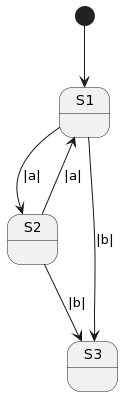

===========================
Hierarchical State Machines
===========================

Frame supports the notion of states inheriting behavior from other states. In doing so, 
a system develops a hierarchy of parent-child relationships between states. A state machine 
that supports hierarchy is known as a **Hierarchical State Machine (HSM)**.

Hierarchy is useful for factoring common behavior between states into a parent, thus normalizing
the implemenation of behavior and eliminating redundancy in the system. In an HSM, when  
changes are made to the shared behavior there is a single place to make the modification. 

.. code-block::
    :caption: Interface Examples

    #RedundantSystem

        -interface-

        a 
        b
        
        -machine-

        $S1 
            |a| -> "a" $S2 ^
            |b| -> "b" $S3 ^

        $S2 
            |a| -> "a" $S1 ^
            |b| -> "b" $S3 ^
            
        $S3

    ##

Above we see a simple system with three states. States **$S1** and **$S2** share the common behavior 
of **|b| -> "b" $S3 ^**. To eliminate the redundancy, we will 
create a new parent state and refactor the common behavior into it. 

    #HSM1

        -interface-

        a 
        b

        -machine-

        $S0 
            |b| -> "b" $S3 ^

        $S1 => $S0
            |a| -> "a" $S2 ^

        $S2 => $S0
            |a| -> "a" $S1 ^
            
        $S3
    ##

.. image:: images/hsm_with_parent.png
