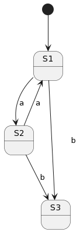
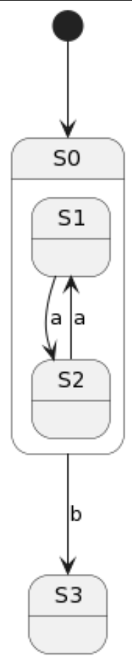

===========================
Hierarchical State Machines
===========================

Frame supports the notion of states inheriting behavior from other states. In doing so, 
a system develops a hierarchy of parent-child relationships between states. A state machine 
that supports hierarchy is known as a **Hierarchical State Machine (HSM)**.

Hierarchy is useful for factoring common behavior between states into a parent, thus normalizing
the implemenation of behavior and eliminating redundancy in the system. In an HSM, when  
changes are made to the shared behavior there is a single place to make the modification. 

Parent-child relationships are established between states using the **dispatch operator =>**. We 
have seen this used elsewhere for forwarding events to other states during a transition. 

.. code-block::
    :caption: Defining Parent-Child States Using the Dispatch Operator

    $Child => $Parent

Multiple children can derive behavior from the same parent.

.. code-block::
    :caption: Defining Parent-Child States Using the Dispatch Operator

    $Child1 => $Parent
    $Child2 => $Parent 

State hierarchy can extend to any depth.

.. code-block::
    :caption: State Hierarchy Depth

    $S3 => $S2
    $S2 => $S1
    $S1 => $S0

The next example will show refactoring of a common behavior between two states to a parent state. 

.. code-block::
    :caption: Flat State Machine

    #FlatStateMachine

        -interface-

        a 
        b
        
        -machine-

        $S1 
            |a| -> "a" $S2 ^
            |b| -> "b" $S3 ^

        $S2 
            |a| -> "a" $S1 ^
            |b| -> "b" $S3 ^
            
        $S3

    ##

Above we see a simple system with three states. States **$S1** and **$S2** share the common behavior 
of **|b| -> "b" $S3 ^**. To eliminate the redundancy, we will 
create a new parent state and refactor the common behavior into it. 

.. code-block::
    :caption: Hierarchical State Machine

    #HSM1

        -interface-

        a 
        b

        -machine-

        $S0 
            |b| -> "b" $S3 ^

        $S1 => $S0
            |a| -> "a" $S2 ^

        $S2 => $S0
            |a| -> "a" $S1 ^
            
        $S3
    ##

Supporting the HSM architecture is one of the primary reasons the Frame runtime is event based which  
makes supporting this feature using event passing straightforward to implement. 

Event Handler Continue Terminator
+++++++++++

By default and by design, unhandled events such as **b** in states **$S1** and **$S2** in the example above pass 
through to the parent state **$S0**. In some circumstances, however, it is desirable to execute 
behavior in both the child and the parent. To facilitate this capability, event handlers are also able 
to be terminated with a continue operator **:>**. After executing all statements in the child event handler,
the continue operator will not return but allow the event to pass to the parent. 

.. code-block::
    :caption: Event Handler Continue Terminator

    fn main {
        var sys:# = #ContinueTerminatorDemo()
        sys.passMe1()
        sys.passMe2()
    }

    #ContinueTerminatorDemo

        -interface-

        passMe1
        passMe2 

        -machine-

        // Dispatch operator (=>) defines state hierarchy

        $Child => $Parent 

            // Continue operator sends events to $Parent

            |passMe1|  :>
            |passMe2|  print("handled in $Child") :>

        $Parent

            |passMe1| print("handled in $Parent") ^
            |passMe2| print("handled in $Parent") ^

    ##

Above we see two scenarios in the **$Child** state. In the **|passMe1|** event handler, there are 
no statements and the event is passed on to the **$Parent** state. In the **|passMe2|** event handler 
a print statement is executed first and then the event is passed on to the **$Parent** for 
further processing. 

Run the `program <https://onlinegdb.com/l7WBIHtd7>`_. 

.. code-block::
    :caption: Event Handler Continue Terminator Output

    handled in $Parent
    handled in $Child
    handled in $Parent

A final example demonstrates that enter and exit messages obey the same rules as other events.

.. code-block::
    :caption: Parent Child Enter Exit Demo

    fn main {
        var sys:# = #ParentChildEnterExitDemo()
        sys.next()
        sys.next()   
    }

    #ParentChildEnterExitDemo

        -interface-

        next

        -machine-

        // Dispatch operator (=>) defines state hierarchy

        $Child1 => $Parent  
            |>|  print("enter handled in $Child1") :>
            |<|  print("exit handled in $Child1") :>

            |next| -> $Child2 ^
        

        $Child2 => $Parent  
            |>|  print("enter handled in $Child2") :>
            |<|  print("exit handled in $Child2") :>

            |next| -> $Child1 ^   

        $Parent 
            |>| print("enter handled in $Parent") ^
            |<| print("exit handled in $Parent") ^ 
    ##

Run the `program <https://onlinegdb.com/KFVFsIXav>`_. 

.. code-block::
    :caption: Parent Child Enter Exit Demo Output

    enter handled in $Child1
    enter handled in $Parent
    exit handled in $Child1
    exit handled in $Parent
    enter handled in $Child2
    enter handled in $Parent
    exit handled in $Child2
    exit handled in $Parent
    enter handled in $Child1
    enter handled in $Parent
