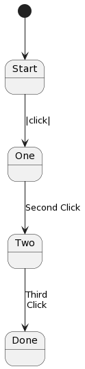

==================
Transitions and States
==================

The ability to switch between states a fundamental attribute 
of a state machine. Frame supports two mechanisms for doing so:

#. Transitions 
#. State Changes 

Transitions are powerful and potentially expensive operations that drive much of the 
Frame runtime machinery. 
State Changes are an optimization of Transtions which are 
useful for both their speed of operation as well as some special case system design scenarios. 

Transitions
------------

Transitions are affected by using the **->** operator to go to another state. 

.. code-block::
    :caption: Basic Transition Demo

    #BasicTransitionDemo

        -interface-

        next 

        -machine-

        $Start 
        
            |next| -> $End ^

        $End
    ##

Above we see a system initialized in the **$Start** start state that will transition to 
to the **$End** state upon receiving the **next** event. 

This example does not, however, highlight what is happening behind the scenes in the Frame runtime. 
We will take a look at that behavior next. 

Enter and Exit Events
++++++++++++++++

As discussed elsewhere, one of Frame's most powerful features is the ability to intialize 
and cleanup states upon entry and exit respectively. 
This powerful capability unlocks many improvements to code structure and readability of 
Frame generated software. 

Upon transitioning Frame first sends a system reserved "exit" message **<** to the current state.  
Below we see an exit handler added to the **$Start** state that prints a message upon exit.

.. code-block::
    :caption: Exit State Transition Demo

        $Start 
            |<| print("exiting $Start state") ^
            |next| 
                print("transitioning to $End state")
                -> $End ^
        
        $End
 
 After sending the exit message to the current state, the Transition runtime mechanism updates
 the current state to the Transition target state (in this case **$End**) and then sends 
 an "enter" message **>** to the new current state.

.. code-block::
    :caption: Enter State Transition Demo

        $Start 
            |<| print("exiting $Start state") ^
            |next| 
                print("transitioning to $End state")
                -> $End ^
        
        $End
             |>| print("entering $End state") ^

.. code-block::
    :caption: Basic Transition Behavior Demo

    fn main {
        var btmd:# = #BasicTransitionBehaviorDemo() 
        btmd.next()
    }

    #BasicTransitionBehaviorDemo

        -interface-

        next 

        -machine-

        $Start 
            |<| print("exiting $Start state") ^
            |next| 
                print("transitioning to $End state")
                -> $End ^
        
        $End
             |>| print("entering $End state") ^
    ##

Run the `program <https://onlinegdb.com/pi4GXit3Y>`_. 

The program generates the following output:

.. code-block::
    :caption: Basic Transition Behavior Demo Output

    transitioning to $End state
    exiting $Start state
    entering $End state

Enter Event Parameters
++++++++++++++++

In the `States and Transitions`_ article we saw one way to send data directly from 
one state to another by using **state parameters**. 
Another way to accomplish state-to-state data transfer is using **enter event parameters**. 

.. code-block::
    :caption: Enter Event Parameters Demo

    -> ("Hello next state!") $NextState 

The Frame transition operator accepts an expression group as arguments to the new state. 

.. code-block::
    :caption: Enter Event Parameters Demo 1

    fn main {
        var sys:# = #EnterEventParametersDemo1() 
        sys.next()
    }

    #EnterEventParametersDemo1

        -interface-

        next 

        -machine-

        $Start 
            |next| 
                -> ("Hello")  $End ^
        
        $End
             |>| [msg] print(msg) ^
    ##

Above we see that the transition passes a message to the **$End** state which is recieved
as a parameter to the event handler which is then printed. 

Run the `program <https://onlinegdb.com/EbQkoWXmq>`_. 

The program generates the following output:

.. code-block::
    :caption: Enter Event Parameters Demo 1 Output

    Hello

The next examples demonstrates the use of both state-to-state direct data transfer mechanisms together. 

.. code-block::
    :caption: Enter Event Parameters Demo 2

    fn main {
        var sys:# = #EnterEventParametersDemo2() 
        sys.next()
    }

    #EnterEventParametersDemo2

        -interface-

        next 

        -machine-

        $Start 
            |next| 
                -> ("$Start", "Hello")  $End("$End") ^
        
        $End [to]
             |>| [from, greeting] 
                print(greeting + " " + to + ". Love, " + from) ^
    ##

Above we see that the transition sends two strings **("$Start", "Hello")** as arguments that 
match the enter event parameters **|>| [from, greeting] ** for **$End**. In addition, 
the transition also passes an argument **$End("$End")** to the **End** state parameter 
**$End [to]**.

This fully demonstrates the mechanisms for passing data to the next state without needing to persist 
it in some way before transitioning. 

Run the `program <https://onlinegdb.com/j9tQw2DVr>`_. 

The program generates the following output:

.. code-block::
    :caption: Enter Event Parameters Demo 2 Output

    Hello $End. Love, $Start

Exit Event Parameters
++++++++++++++++

In addition to passing data to the enter handler of the next state, Frame also provides a means 
to pass data to the exit handler of the current state during a transition. 

.. code-block::
    :caption: Exit Event Goodbye Demo

    fn main {
        var sys:# = #ExitEventGoodbyeDemo() 
        sys.next()
        
    }

    #ExitEventGoodbyeDemo

        -interface-

        next

        -machine-

        $Start 
            |<| [msg,state]
                print(msg + " " + state + "!") ^

            |next| 
                ("goodbye", "$Start") -> $End ^     

        $End

    ##

Above we see that, similar to the enter args group specified for the next state, transitions also 
accept an exit args group to be specified for the exit handler. 

Run the `program <https://onlinegdb.com/95DSxesC->`_. 

The program generates the following output:

.. code-block::
    :caption: Enter Event Goodbye Demo 2 Output

    goodbye $Start!

Recalling that Frame enables access to the various parts of the event, another example will 
show how to use the event message token (**@||**) to parameterize the exit behavior of the 
start state. 

.. code-block::
    :caption: Exit Event Parameters Demo

    fn main {
        var sys:# = #ExitEventParametersDemo() 
        sys.one()
        sys.two()
    }

    #ExitEventParametersDemo

        -interface-

        one 
        two

        -machine-

        $Start 
            |<| [event_msg]
                event_msg == "one" ? print(event_msg + " is a great number!") :>
                event_msg == "two" ? print(event_msg + " is a greater number!") :| ^

            |one| (@||) -> $Start ^
            |two| (@||) -> $Start ^       

    ##

This system simply loops back to the start state and passes the message that triggered 
the transition to the exit handler to print a customized message. This capability enables 
factoring out common cleanup behavior with a way to customize it based on the way 
that the system is being exited. 

Run the `program <https://onlinegdb.com/axQHAdQPE>`_. 

The program generates the following output:

.. code-block::
    :caption: Enter Event Parameters Demo 2 Output

    one is a great number!
    two is a greater number!

Transition Labels
++++++++++++++++

.. code-block::
    :caption: Transition Labels 

    #TransitionLabels

        -interface-

        click

        -machine-

        $Start 
            |click| -> $One ^

        $One 
            |click| -> "Second Click" $Two ^

        $Two 
            |click| -> "Third\nClick" $Done ^

        $Done
    
    ##

The UML diagram generated by Frame 

Forwarding Events
++++++++++++++++

Grouping Syntax
++++++++++++++++

State Change
------------

#ChangingState

    -interface-

    transition
    changeState

    -machine-

    $S0
        |<| handleTransitionExitEvent() ^
        |transition| -> "transition" $S1 ^

    $S1
        |>| handleTransitionEnterEvent() ^
        |changeState| ->> "change state" $S0 ^

    -actions-

    handleTransitionExitEvent
    handleTransitionEnterEvent
##